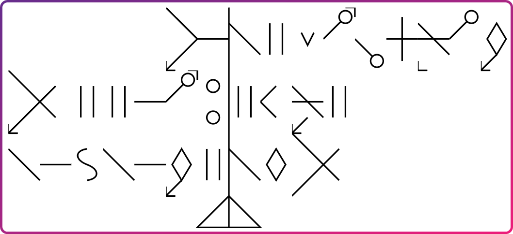
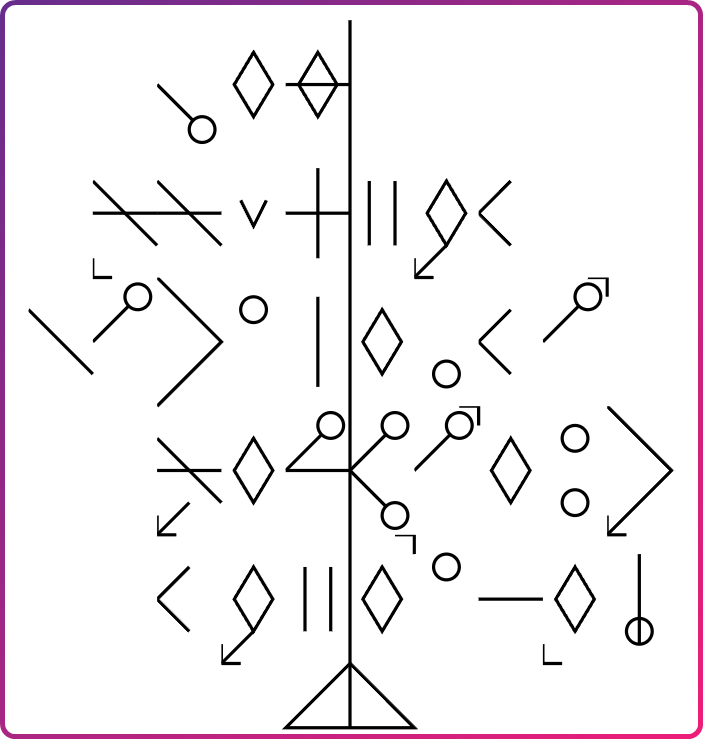
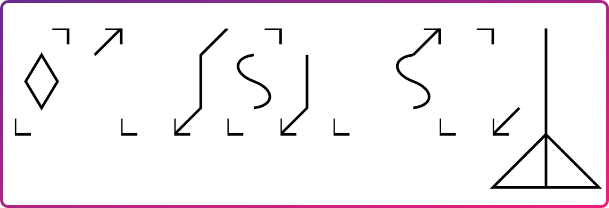
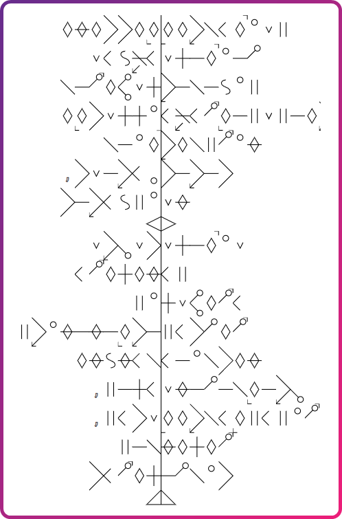

# StarGlyph
Try me [here](https://rocketprinter.github.io/StarGlyph/)!

> This is some text written in StarGlyph

### Wut is this
Starglyph is a quirky writing system invented by me. Try to figure out how it works! 

The repo conists of three projects: a C# class library for converting normal text to an svg, a test app and a convenient blazor website.
The blazor site is deployed to [github pages](https://rocketprinter.github.io/StarGlyph/).

### More examples

> The quick brown fox jumps over the lazy dog

> 35*42=1470

> Some lorem ipsum